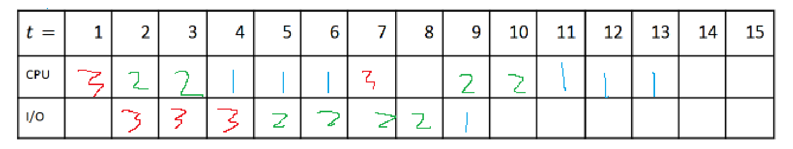
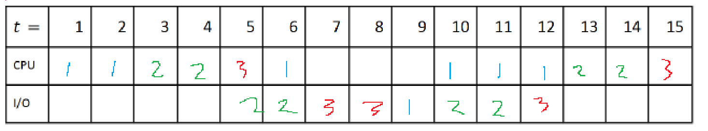

# Practice Quiz 2

## Pipelining

### Buffer contents
- IF - instruction into IR, pc++
  - ALU, PC, MEM
- FBUF
  - instructions from mem
- ID/RR - read register contents
  - Regfile, decode logic
- DBUF
  - decoded IR and regfile values 
- EX - perform arithmetic/address computation (maybe)
  - ALU
- EBUF
  - result of ALU op + other instruction specific things
- MEM - fetch/store memory operand (maybe)
  - MEM
- MBUF
  - same as EBUF if not LW or SW, if LW then contains contents of memory read 
- WB - write to register (maybe)
  - Regfile

Each buffer contains the contents needed for the next stage(s)
Regfile must be dual ported to support read and write in diff stages (but same cycle)

### Structural hazards
- cause by hardware limitations
- ex: BEQ sometimes needs EX twice (t/f branch + address calc), creates a bubble

### Data hazards
- RAW - use the table
- WAR - not an issue
- WAW - causes stalls?

### Control hazards - branching
- happens when we mispredict a branch

<!-- ### Handling Hazards
- Data forwarding: eliminates most RAW hazards except for lw
- busy bits: use a busy bit to denote if something is beign written to, not an issue for our static issue pipeline? -->

## Scheduling
- non preemptive: will NOT interrupt current process to start new one
- preemptive:l able to intterupt current process
  - uisually requires an external interrupt
- reponse time/turnaround time: program end - program start
- wait time: time when program not running
- throughput: #jobs/time
- PCB: process control block, represents current state of processor
  - pc address, regfile, next pcb, priority (of processers), memory footprint
  - use to switch between states (processes, schedluing)
- process: program in execution (program + execution state)
- loader: loads program from disk to mem
- dispatcher: populates the registers with the state of the process selected forrunning by the short term scheduler
- draining: allowing opers to finish 
- flushing: removing all in progress ops

## Non Preemptive scheduling algos
- FCFS: first come first serve, very basic
  - high average waiting and turnaround times, convoy effect
- SJF: shortest job first
  - starvation, low average waiting and turnaround times
  - some cpu underutilization

## Preemptive scheduling algos
- Priority: extrinsic?
  - run program with highest priority
  - starvation
- Round Robin: slices of x
  - too high: does not divide evenly 
  - too low: overhead
- FCFS with preemption
  - 
- SRTF? SJF with preemption
  - if a job enters the ready queue with shorter time than the remaining time of cur job, can preempt job

## Practice Questions
1. alu, rx, opcode
2. I2 I2 RAW, I3 I2 WAW and RAW, I4 I1 RAW, 
3. q3
   1. for each branchinch instruction, how often that branch has been taken and its target address
   2. better branch prediction
4. q4 - not sure abt these answers
   1. wrong branch prediction
   2. interrupts
   3. WAW, conservative branching, 
5. 4 + 9 + 3*4 = 25 cycles => 25 cycles/13 instructions. (I am confused on CPI definition)
6. everything should be one clock cycle, should allow every instruction to spend exactly one clock cycle in each stage. Also the duration each stage takes should be roughly equal
7. 3
   1. 2*35 + 1 = 71
   2. (4+4) + 35 * (7+3+3+7) + 7 + 3+4 = 722 cycles => 361 ns
8.  (3* .75 + 6*.20 + 4*.05) = 3.65
    1. (b):  (3.60/3.65)^{-1} = ~1.0139x increase permissable
    2. .98x "faster", -1.37% speedup
9. 
   1.  (7+10+13)/3=10
   2.  (0+3+2+1+1+1)=2.7
   3.  (5+8+7)/3=6.67
   4.  3/13 = 0.23 jobs/sec
   5.  12/13? = 92.31%
   6.  
   7.  not trynan do all this
   8.  L: overhead of preempting proccesses 
10. First come first serve is suseptible to the convoy effect, where a long running process stops the other (shorter) proccesses from running
11. PCB is used to save the state of the processor and is useful for saving the state of procccesses for preempting
    1.  contains information about the current state, like the regfile, priority (for priority scheudling), PC, memory footprint, time left, next pcb, current state type (new, ready, halted, running, waiting)
    2.  in a ready queue, which is a linked list of PCBs, which is stored in OS memory.
12. Some scheduling algorithms may consistently prioritize new processes over existing ones, which can lead to starvation. For example a long process in SJF where new short processes keep getting added.
    1.  Aging, where older processes are given higher priority
    2.  SJF (mentioned). Priority (low priority process where new procceses have higher prio)
13. a process is a program that is being executed